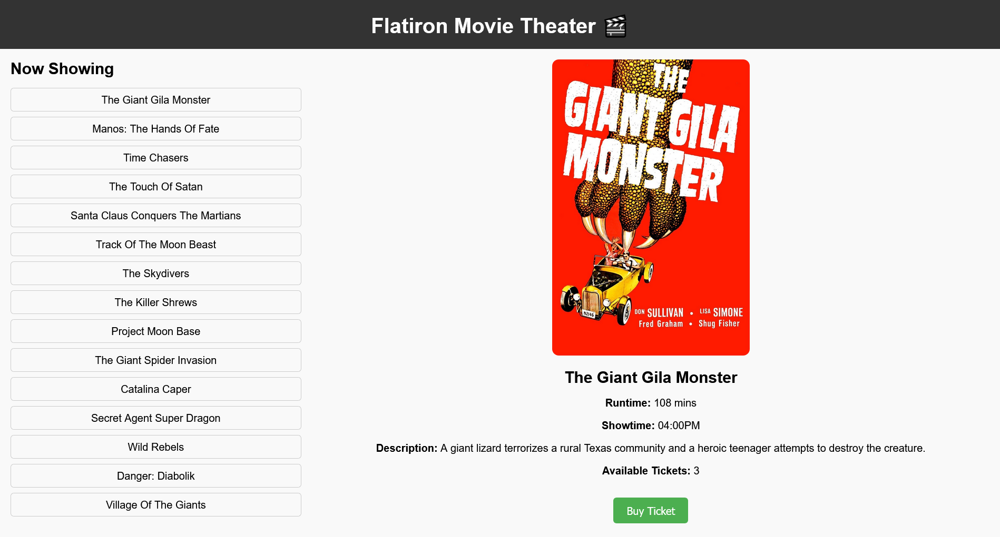

# Flatdango Movie Theater

A simple web application that showcases current movie listings at a fictional "Flatiron Movie Theater", allowing users to view movie details and purchase tickets.

## Table of Contents

1. [Overview](#overview)
2. [Installation](#installation)
3. [Usage](#usage)
4. [Contributing](#contributing)
5. [Project Structure](#project-structure)
6. [License](#license)

## Overview

**Flatdango** is designed for movie enthusiasts or anyone looking to check movie schedules at the Flatiron Movie Theater. This project:

- **Solves the problem** of needing a quick, user-friendly way to see what movies are currently showing.
- **Provides features** such as:
  - Displaying a list of movies currently screening.
  - Showing detailed information for each movie including title, runtime, showtime, description, and ticket availability.
  - Allowing users to "buy" tickets, which updates ticket availability in real-time.
- **Is for** movie-goers, cinema staff, or anyone interested in cinema schedules and movie information.

## Installation

**Prerequisites:**

- Node.js (version 22 or later)
- NPM (Node Package Manager)

**Steps to install:**

1. **Clone the repository:**
   ```bash
   git clone https://github.com/your-username/Flatdango.git

##   Usage
Once the application is running:

Navigate to the frontend URL in your browser.
Browse through the list of movies on the left side. Click on a movie to see its details on the right.
If tickets are available, you can click the "Buy Ticket" button to reduce the ticket count for that movie.

Screenshot:

Screenshot of FlatdangoNote: 


##   Contributing
Contributions are welcome! Here’s how you can contribute:

Fork the repository.
Create a new branch: git checkout -b feature-branch
Make your changes.
Commit your changes: git commit -m 'Description of changes'
Push to the branch: git push origin feature-branch
Submit a pull request describing your changes.

Please ensure that any pull request complies with the project’s coding standards.

##   Project Structure
/Flatdango
│
├── index.html           # The main HTML file
├── styles.css           # CSS for styling
├── script.js            # JavaScript for interactivity
├── db.json              # Mock API data for movies
└── README.md            # This file

##    License
This project is licensed under the MIT License - see the LICENSE file for details.

Author: Cheruiyot Brent Langat

Copyright (c) 2024 Brent Cheruiyot

Permission is hereby granted, free of charge, to any person obtaining a copy of this software and associated documentation files (the "Software"), to deal in the Software without restriction, including without limitation the rights to use, copy, modify, merge, publish, distribute, sublicense, and/or sell copies of the Software, and to permit persons to whom the Software is furnished to do so, subject to the following conditions:

The above copyright notice and this permission notice shall be included in all copies or substantial portions of the Software.

THE SOFTWARE IS PROVIDED "AS IS", WITHOUT WARRANTY OF ANY KIND, EXPRESS OR IMPLIED, INCLUDING BUT NOT LIMITED TO THE WARRANTIES OF MERCHANTABILITY, FITNESS FOR A PARTICULAR PURPOSE AND NONINFRINGEMENT. IN NO EVENT SHALL THE AUTHORS OR COPYRIGHT HOLDERS BE LIABLE FOR ANY CLAIM, DAMAGES OR OTHER LIABILITY, WHETHER IN AN ACTION OF CONTRACT, TORT OR OTHERWISE, ARISING FROM, OUT OF OR IN CONNECTION WITH THE SOFTWARE OR THE USE OR OTHER DEALINGS IN THE SOFTWARE.